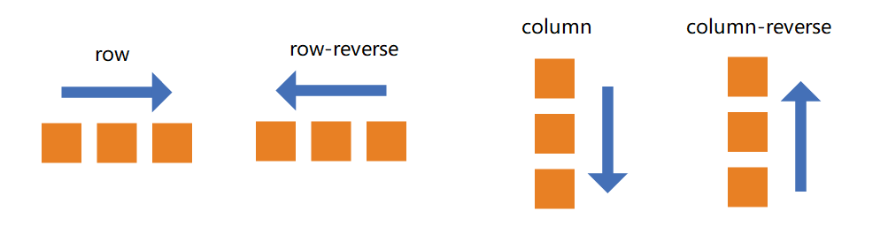

# Flex

采用 Flex 布局的元素，称为 Flex 容器（flex container），简称"容器"。它的所有子元素自动成为容器成员，称为 Flex 项目（flex item），简称"项目"。

注意，设为 Flex 布局以后，子元素的 float、clear 和 vertical-align 属性将失效。

容器默认存在两根轴：水平的主轴（main axis）和垂直的交叉轴（cross axis）。主轴的开始位置（与边框的交叉点）叫做 main start，结束位置叫做 main end；交叉轴的开始位置叫做 cross start，结束位置叫做 cross end。

项目默认沿主轴排列。单个项目占据的主轴空间叫做 main size，占据的交叉轴空间叫做 cross size。  
 

## flex 容器的属性

 

### <b>1.flex-direction</b>

 

flex-direction 属性决定主轴的方向（即项目的排列方向）

---

在 flex 布局中，是分为主轴和侧轴两个方向，也可以理解为 x 轴和 y 轴

> - 默认主轴的方向就是 x 轴的方向，水平向右
> - 默认侧轴的方向就是 y 轴的方向，水平向下

#### flex-direction 的属性

> row : 主轴为 x 轴，水平方向，自左向右  
> row-reverse : 主轴为 x 轴，水平方向，自右向左  
> columu : 主轴为 y 轴，垂直方向，自上向下  
> columu-reverse : 主轴为 y 轴，垂直方向，自下向上

 

  
 

### <b>2.justify-content</b>

justify-content 属性定义了项目在主轴上的对齐方式。

---

注意：使用这个属性之前，要先确认主轴是哪一个。
 

#### justify-content 的属性

> flex-start(默认值)：从头部开始，如果 x 是主轴，方向从左到右  
> flex-end：从尾部开始，方向从右到左  
> center：在主轴居中对齐  
> space-between：先两边贴边 再平分剩余空间
> space-around：平分剩余空间

 

 

### <b>3.flex-wrap</b>

 
默认情况下，项目都排在一条线（又称"轴线"）上，默认子元素不换行。flex-wrap属性定义，如果一条轴线排不下，如何换行。
 

---
侧轴默认为y轴

#### flex-wrap 的属性

> nowrap(默认值)：不换行  
> wrap：换行，第一行在上方  
> wrap-reverse：换行，第一行在下方

 

### <b>4.align-items</b>

 
属性定义项目在侧轴(y轴)上如何对齐
 

---
项目必须为单行才生效

#### align-items 的属性

> flex-start(默认值)：从上到下   
> flex-end：从下到上   
> center：挤在一起居中(垂直居中)   
> stretch：拉伸(项目未设置高度或者设为auto，将占满整个容器的高度)   
> baseline：项目的第一行文字的基线对齐

 

 

### <b>5.align-content</b>
 
属性定义了多根轴线的对齐方式。如果项目只有一根轴线，该属性不起作用
 

